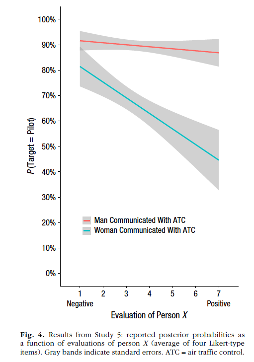

## Introduction

Cao, Kleiman-Weiner and Banaji (2019) explores the moral and statistical imperatives that influence participants' judgments about the likelihood of a hypothetical person being of a particular occupation. The authors note that, when asked who is more likely to be a doctor after a man and a woman perform surgery, the egalitarian moral imperative is to treat both as equally likely to be a doctor, whereas the statistical imperative is to consider priors - and in this case, priors favor the man being more likely to be the doctor. The replication target is study 5, which finds that participants judged a man to be more likely than a woman to be a pilot (a Bayesian judgment), and this judgment was held regardless of their moral evaluation of person X who made an egalitarian judgment. 

I chose this paper because it's an experimental application of Bayes theorem, a ubiquitous framework in the social sciences. Replicating it will require me to internalize the theorem's basic intuitions such as how beliefs are updated with evidence as well as the computations associated with it such as how to calculate odds ratios and how to model posteriors from priors and likelihoods. The experimental paradigm involves a qualitative and computational exploration of how beliefs are updated with evidence, which is a great opportunity to think about how Bayesian principles fit in with people's real world decision-making, an invaluable tool in a social scientist's arsenal. 

If the results of the original study hold, this study will have replicated 2 key findings: the first is that participants will judge a third party who makes a Bayesian judgment as being unfair, unjust, inaccurate and unintelligent. The second, and more important one, is that participants make Bayesian judgments about an airline scenario, with posteriors favoring the communicator being male rather than female, and these Bayesian judgments hold regardless of their evaluation of person X. The study is expected to be conducted on Amazon's task crowd-sourcing marketplace, Mechanical Turk. Some possible expected challenges include low quality of data due to bots or inattentive participants, and the possibility of participants looking up answers to the filler questions about unrelated statistical phenomena.

Link to the [repository](https://github.com/psych251/cao2019)  
Link to the [Qualtrics survey](https://stanforduniversity.qualtrics.com/jfe/form/SV_80xBOBxnipQ3R4x)
Link to the [prergistration](https://osf.io/h37qu)  

## Methods

### Power Analysis

The original sample size for study 5 was 353 participants.  For finding 1 (person X evaluations), the reported Cohen's d effect size was 0.48. Using the G*Power software, the sample size required to achieve 80% power was calculated to be 37. 

For finding 2 (the key finding - Bayesian judgments regardless of person X evaluations), the Cohen's f effect size was calculated to be 0.48, and the sample size that would achieve 80% power was calculated to be 36. 


### Planned Sample

The sample sizes and 37 and 37 make it feasible to attempt replicate both findings simultaneously with a sample size of 37. In order to account for exclusions, a sample of 38 American Mturk workers will be ran. 

### Materials and Procedure

 Participants from Amazon Mturk will be recruited and compensated $0.85 each. The study will proceed in 3 parts.

> Experiment description 
The study  will consist of three parts; the first part will query people's prior, posterior, and likelihood estimates of an air traffic control (ATC) communicator either being male or female; the second part will compute a model posterior for each participant and compare it with their actual posterior; and the third part will have the participants evaluate the moral character of a third party who makes a Bayesian judgment about the same scenario.

"In the first part, each participant was randomly assigned to learn that either a man or a woman had communicated with air traffic control during a flight. Participants provided their priors, posteriors, and likelihoods for this scenario" 

"In the second part, participants completed filler tasks consisting of unrelated statistical judgments (e.g., “What percentage of the earth’s surface is covered by land?”) and trivia (e.g., “The German word kummerspeck means excess weight gained from emotional overeating”).

In the third part, participants completed the same procedure as in Study 1, in which they indicated which of three statements they agreed with and evaluated person X, who made the Bayesian judgment that a man who performed surgery is more likely to be a doctor than a woman who performed surgery.Participants then completed four Likert-type scales that assessed how (a) fair, (b) just, (c) accurate, and (d) intelligent person X’s statement was. Each scale ranged from 1 (e.g., extremely unfair) to 7 (e.g., extremely fair)."

The first part involving priors, posteriors and likelihoods will be composed of three sub-parts: 

"Part 1: priors. Participants will be instructed to imagine a man and a woman who work at the same airline. One person is a pilot and the other person is not a pilot, but who is the pilot and who is not is unknown. Participants will estimate the percentage chance that each person is the pilot. Because there are two hypotheses—either the man or the woman is the pilot (and the other is the not)—both estimates had to sum to 1. Thus, each participant will provide his or her subjective prior about each person’s profession (e.g., the man has a 75% chance of being the pilot; the woman has a 25% chance of being not the pilot).

Part 2: posteriors. After providing priors, each participant will be randomly assigned to learn one of the following two pieces of data: (a) The man communicated with air traffic control(b) the woman communicated with air traffic control. After learning this datum, participants will again estimated the percentage chance that each person is the pilot. Thus, each participant will provide his or her subjective posterior.

Part 3: likelihoods. Each participant will estimate two likelihoods: the likelihood of observing the datum given the hypothesis that the target they learned about is the pilot and the likelihood of observing the datum given the hypothesis that the target they learned about is not the pilot. For example, if a participant learned that the woman had communicated with air traffic control, that participant will estimate the percentage of female pilots who communicate with air traffic control and the percentage of female non-pilots who communicate with air traffic control. If a participant learned that the man had communicated with air traffic control, that participant will estimated the percentage of male pilots who communicate with air traffic control and the percentage of male non-pilots who communicate with air traffic control. Thus, each participant will provide his or her subjective likelihood estimates, which will be combined by forming a ratio. Each participant will be randomly assigned to estimate the corresponding likelihoods either before or after providing subjective priors and posteriors. Each participant’s priors and likelihoods will be entered into Bayes’s rule to compute a model posterior, which represents what the participant’s posterior should be from a statistical perspective. This model posterior will be compared with the posterior that the participant actually reported.


### Analysis Plan

Participants will be excluded who provide priors of either 0% of 100% since these cannot be updated in accordance with Bayes rule. 

Participants who indicate that they looked up answers to the trivia questions will also be excluded. 

An additional exclusion criteria will be an attention check at the end of the study that asks participants to indicate whether they were distracted, had trouble paying attention, or whether something else negatively affected their participation. Participants will be excluded who agree to any one of the above statements.

Key descriptive statistics such as means and standard errors for judgments among participants in each condition will be computed and some plotted. 

The key statistical test used to replicate finding 2 will be a two-way ANOVA with linear model fit examining the effects of person X evaluations ([1] negative to [7] positive) and target gender (male or female) on posterior judgments. These findings were represented visually in figure 4. 

A secondary replication target (finding 1) will be a one-sample t-test to investigate the composite average Likert scores evaluating how fair, accurate, intelligent and just the participants would find Person X's Bayesian judgment. 
 

The analysis

### Differences from Original Study

The main difference in implementation is the sample size. The original sample size for study 5 was 353, however this replication will sample 36 participants from Mturk. This amount will help achieve 80% power. 
Another difference is the added self-reported attention check at the end of the study. This will help filter out participants whose responses are negatively affected by distractions.   

### Methods Addendum (Post Data Collection)

#### Actual Sample

Data was collected from 38 English-speaking Americans on Mturk. The sample demographics were as follows = age: M = 38.67 years, SD = 11.14; 24 men, 13 women.
Data exclusions based on rules spelled out in analysis plan:
+ Exclusion 1 participants who indicated they looked up answers to trivia questions = 1
+ EXclusion 2 participants who were unable to update priors = 1
+ Exclusion 3 participants who failed self-reported attention check = 0
+ Total exclusions = 2
+ Final sample = 36

#### Differences from pre-data collection methods plan

  None

## Results
 
# Data Preparation

```{r setup, include=FALSE}
#### Load Relevant Libraries and Functions
library(tidyverse)
library(dplyr)
library(plyr)
library(knitr)
library(srvyr)
library(moments)
library(rstatix)
library(scales)
library(car)
library(lsr)
library(MBESS)

dat = read_csv("caofinal.csv")

filter(dat, lookup==1)  #1 person indicated that they looked up answers
filter(dat, attn==!7) #no one reported attention challenges
filter(dat, Finished == !1) #no one didn't finish study
tally(dat) #n = 38 participants (excl first 2 rows)

### CHECK WHETHER SORTING BY MAN IRST MAY HAVE AFFECTED MY NEW COLUMNS

```

# Data Cleaning and exclusions

```{r}

dat <- dat %>% 
   rename(cond1.prior_manPilot.womanFlightAttendant = X1.prior_1,  #prior prob that man is pilot
          cond1.prior_womanPilot.manFlightAttendant = X1.prior_2, #prior prob that woman is pilot
          cond1.post_manPilot.womanFlightAttendant = X1.post_1, #posterior prob that man is pilot
          cond1.post_womanPilot.manFlightAttendant = X1.post_2, #posterior prob woman is pilot
          cond1.lk_percent.male.pilots.comm.ATC = X1.lk_1_1,  
          cond1.lk_percent.male.flightAttendants.comm.ATC = X1.lk_2_1,
          
          cond2.prior_manPilot.womanFlightAttendant = X2.prior_1, #prior prob that man is pilot
          cond2.prior_womanPilot.manFlightAttendant = X2.prior_2, #prior prob that woman is pilot
          cond2.post_manPilot.womanFlightAttendant = X2.post_1, #posterior prob that man is pilot
          cond2.post_womanPilot.manFlightAttendant = X2.post_2, #posterior prob woman is pilot
          cond2.lk_percent.female.pilots.comm.ATC = X2.lk_1_1,
          cond2.lk_percent.female.flightAttendants.comm.ATC = X2.lk_2_1,
          
          X1.free = c1.free, #convert to more manageable naming convention
          X2.free = c2.free
          ) 
     
dat <- dat %>%
  slice(3:length(dat$ResponseId)) %>% #remove first 2 rows (unnecessary titles)
  filter(lookup==2) %>% #exclusion1: exclude participants who said they looked up trivia answers
  filter(attn==7) %>% #exclusion2: exclude if participants report attention affected performance
  filter(!is.na(cond1.prior_manPilot.womanFlightAttendant)|!is.na(cond2.prior_manPilot.womanFlightAttendant)) %>%#cut blanks
  # arrange(cond1.prior_manPilot.womanFlightAttendant) %>% #sort by condition
  mutate(condition = ifelse(is.na(cond1.prior_manPilot.womanFlightAttendant), "2", "1")) %>% #create condition column
  dplyr::select(!starts_with("Q")) %>%  #remove columns with Trivia responses
  mutate_at(vars(age), as.numeric) %>%
  mutate_at(vars(gender), as.numeric) %>%
  mutate_at(vars(contains('cond')), as.numeric) %>% #judgments to numeric
  mutate_at(vars(contains('c1')), as.numeric) %>% #attributions to numeric 
  mutate_at(vars(contains('c2')), as.numeric) 


#demographic summary stats 
mean(dat$age)
sd(dat$age)
count(dat$gender)
tally(dat)

```


# Data Wrangling

Create prior percent and posterior percent columns by first computing odds ratios then converting to percent


```{r}

dat <- dat %>%
  #Create combined prior and target columns
  mutate(Prior.Man.Pilot = if_else(!is.na(cond1.prior_manPilot.womanFlightAttendant),
                                   cond1.prior_manPilot.womanFlightAttendant, 
                                   cond2.prior_manPilot.womanFlightAttendant)) %>% 
  mutate(Prior.Woman.Pilot = if_else(!is.na(cond1.prior_womanPilot.manFlightAttendant),
                                     cond1.prior_womanPilot.manFlightAttendant, 
                                     cond2.prior_womanPilot.manFlightAttendant)) %>% 
  mutate(target = if_else(condition == 1, "man", "woman")) %>% 
  mutate_at(vars(target), factor) %>% # target to factor
  mutate(Prior.Target.Pilot = ifelse(target == "man", Prior.Man.Pilot, Prior.Woman.Pilot)) %>%
  mutate(able.to.update = ifelse(Prior.Target.Pilot == 1 | Prior.Target.Pilot == 0, "no", "yes")) %>% 
  
  #Create combined posterior columns
  mutate(Posterior.Man.Pilot = ifelse(!is.na(cond1.post_manPilot.womanFlightAttendant),
                                      cond1.post_manPilot.womanFlightAttendant, 
                                      cond2.post_manPilot.womanFlightAttendant)) %>% 
  mutate(Posterior.Woman.Pilot = ifelse(!is.na(cond1.post_womanPilot.manFlightAttendant),
                                        cond1.post_womanPilot.manFlightAttendant, 
                                        cond2.post_womanPilot.manFlightAttendant)) %>% 
  mutate(Posterior.Target.Pilot= ifelse(target == "man", 
                                        Posterior.Man.Pilot, 
                                        Posterior.Woman.Pilot)) %>% 
  
  #Create odds ratios then convert to percent 
  mutate(prior.odds.ratio = ifelse(target == "man", 
                                   Prior.Man.Pilot/ Prior.Woman.Pilot,
                                   Prior.Woman.Pilot/ Prior.Man.Pilot)) %>% 
  mutate(posterior.odds.ratio = ifelse(target == "man",
                                   Posterior.Man.Pilot/ Posterior.Woman.Pilot,
                                   Posterior.Woman.Pilot/ Posterior.Man.Pilot)) %>% 
  mutate(prior_percent = prior.odds.ratio/ (1 + prior.odds.ratio)) %>% 
  mutate(posterior_percent = ifelse(is.infinite(posterior.odds.ratio), 
                                    1,
                                    posterior.odds.ratio/ (1 + posterior.odds.ratio))) #convert to %, infinities = 1

#check
dat$Prior.Man.Pilot + dat$Prior.Woman.Pilot  # #confirm priors sum to 100%
hist(dat$Prior.Man.Pilot) # look at distribution of priors 
count(dat$able.to.update)   # no = can't update priors 
dat$Posterior.Man.Pilot + dat$Posterior.Woman.Pilot  #confirm posteriors sum 100 
hist(dat$Posterior.Man.Pilot) # peek at distribution of posteriors overall

#exclude columns w demographic info
dat <- dat %>%
  filter(able.to.update=="yes") %>% #exclusion 3: first filter out participants unable to update priors
  dplyr::select(ResponseId,
                starts_with("cond"), 
                starts_with("c1"),
                starts_with("c2"),
                Prior.Man.Pilot,
                Prior.Woman.Pilot,
                target,
                Prior.Target.Pilot,
                able.to.update,
                Posterior.Man.Pilot,
                Posterior.Woman.Pilot,
                Posterior.Target.Pilot,
                prior.odds.ratio,
                prior.odds.ratio,
                prior_percent,
                posterior_percent)

dat %>%
  group_by(target) %>%
  summarize(mean_prior = mean(prior_percent), #looks like higher priors for man than woman
            mean_posterior = mean(posterior_percent)) #mean still higher for man than woman

```

# Exploratory analyses

### Barplot showing belief updating - average judgments in each condition

```{r}

stderror <- function(x) sd(x)/sqrt(length(x))
dodge <- position_dodge(width = 0.5)

bar <- dat %>%
  dplyr::select(prior_percent, posterior_percent, target) %>%
  pivot_longer(-c("target"),
               names_to = "type",
               values_to = "value") %>%
  mutate_at(vars(type), factor) %>%
  mutate(SE = stderror(value)) %>% 
  mutate(type = fct_reorder(type, value)) 

  
bar %>%
  group_by(target, type) %>%
  summarize(mean = mean(value),
            SE = stderror(value)) %>%
  ggplot(aes(x = target, y = mean, fill = type)) +
  geom_bar(width = 0.7, position= position_dodge(width = 0.75), stat = "identity", ) +
  labs (y = expression(paste(italic(P), "(Target = Pilot)"))) +
  scale_y_continuous(breaks = seq(0, 1, 0.10),
                    label = percent_format()) +
   geom_errorbar(aes(ymax = mean + SE, ymin = mean - SE), position = position_dodge(0.75), width = 0.2) +
  scale_fill_discrete(labels = c("prior",
                                  "posterior")) +
  theme(legend.title = element_blank()) + 
  theme(legend.position = c(0.25, 0.2)) + 
  theme(legend.justification = c(0.25, 0.2)) + 
  theme(legend.direction = "vertical")  


```

### Boxplot showing distribution of judgments across conditions

```{r}

bar %>%
  ggplot(aes(x = target, y = value,  fill = type)) +
  geom_boxplot() +
  labs (y = expression(paste(italic(P), "(Target = Pilot)"))) +
  theme(legend.title = element_blank()) + 
  theme(legend.position = c(0.25, 0.2)) + 
  theme(legend.justification = c(0.25, 0.2)) + 
  theme(legend.direction = "vertical") 

```

### Analyze evaluations of Person X

Replicating Finding 1 results: M = 2.99, SE = 0.26, t(36) = -3.89, p = 0.0004
Original results: M = 2.39, SE = 0.08, t(447) = -8.9, p<.001

This indicates the finding that the participants judged Person X negatively was successfully replicated, as indicated by means below the midpoint of 4 on the Likert scale (unfair M = 3.17, SE = 0.30; unjust M = 2.86, SE = 0.29; inaccurate M = 2.77, SE = 0.31; unintelligent M = 3.13, SE = 0.29), a composite mean of 2.99, and a significant t-test. 


```{r}
# Combine/collapse responses into single columns for both conditions
dat <- dat %>%
  mutate(query = ifelse(condition == "1", c1.self, c2.self),
         intelligent = ifelse(condition == "1", c1.intel, c2.intel),
         accurate = ifelse(condition == "1", c1.acc, c2.acc),
         fair = ifelse(condition == "1", c1.fair, c2.acc),
         just = ifelse(condition == "1", c1.just, c2.just)) %>%
  mutate(composite.avg = (intelligent + accurate + fair + just) / 4) ## Compute composite average

dat %>%
  dplyr::select(intelligent, accurate, fair, just) %>%
  pivot_longer(cols = everything(), names_to = "variable", values_to = "value") %>%
  group_by(variable) %>%
  summarize(mean = mean(value),
            SE = stderror(value))

count(dat$query)
32/35 # 91% agree that both the man and woman equally likely to be a doctor
3/35 # 8% agree that the man is more likely to be a doctor
1/35 # 3% agree that the woman is more likely to be a doctor

mean(dat$composite.avg) #2.99
stderror(dat$composite.avg) # 0.26
t.test(dat$composite.avg, mu = 4) #Confirmatory analysis  (Finding 1)

getwd()

```

### Reproduce figure 4

Below is the original figure taken from the paper. 

```{r echo=FALSE, out.width="100%", fig.align='center'}

```

Comparing the original to the replication figure below, it can be seen that they both show consistently higher posteriors for the male than the female target. However, the replication figure has much wider error bars, and the original trend showing higher differences between male and female target as evaluations become more positive is reversed in the replication - instead, the differences decrease as person X evaluations become more positive. The trend in posterior judgments for each target is also reversed, with the male target showing higher posteriors for participants who made negative evaluations of person X, and these posteriors decreasing as evaluations become more positive, whereas in the woman condition, the posteriors start low then increase as judgments of person X become more positive. 


```{r}

# linear ANVOVA of posterior percent vs person X attributions
dat %>%
  ggplot(mapping = aes(x = composite.avg, y = posterior_percent, color = target)) + 
  geom_smooth(method = "lm", se = TRUE) +
  theme_classic() +
  scale_x_continuous(breaks = seq(1, 7, 1)) + 
  scale_y_continuous(breaks = seq(0, 1, 0.10),
                    label = percent_format()) + 
  theme(aspect.ratio = 10/7) +
  scale_color_discrete(labels = c("Man communicated w/ATC",
                                  "Woman communicated w/ATC")) +
  annotate("text", c(1.5, 5.7), y = -0.15,
           label = c("Negative", "Positive")) +
  annotate("text", c(3.5), y = -0.2 , label = c("Evaluation of Person X")) +
  coord_cartesian(xlim = c(1, 6), ylim = c(0, 1), clip = "off") +
  labs ( y = expression(paste(italic(P), "(Target = Pilot)"))) +
   theme(plot.margin = unit(c(1, 1, 4, 1), "lines"),
         axis.title.x = element_blank(),
         text=element_text(size=12,  family="sans")
   )
           
```

# Normality Checks

```{r}

#distribution of evaluations by condition
dat %>%
  dplyr::select(composite.avg, target) %>%
  pivot_longer(-c("target"),
               names_to = "variable",
               values_to = "value") %>%
  ggplot(aes(x = target, y = value, fill = target)) +
  geom_boxplot() +
  geom_jitter(width = 0.2)

##Target vs posterior percent vs composite.avg point plot
dat %>%
  ggplot(aes(x = composite.avg, y = posterior_percent, color = target)) + 
   geom_point() +
   geom_smooth() +
   scale_x_continuous(breaks = seq(1, 7, 1)) + 
   scale_y_continuous(breaks = seq(0, 1, 0.10),
                    label = percent_format()) 

skewness(bar$value, na.rm = TRUE) #coeff is -0.03

bar %>%
  group_by(target, type) %>%
  identify_outliers(value) #single non=extreme outlier

bar %>%
  group_by (target) %>%
  levene_test(value ~ type) #non-homogeneity of variance in woman condition (0.02 p-value)

select(dat, composite.avg)
range(dat$composite.avg)

```

# Confirmatory Analysis

Replicating finding 2: F(1, 33) = 7.5, p = 0.009, η2 = 0.26, 95% CI = [0.01, 0.39]
Cohen’s f: 0.59

Original result: F(1, 344) = 84.58, p < .0001, η2 = .19, 95% CI = [.13, .27]
Cohen’s f: 0.48


```{r}

## shift composite avgs so it starts from 0
dat <- dat %>%
  mutate(composite.avg.shifted = composite.avg - 1)

## Main effect of target
anova(lm(formula = posterior_percent ~ composite.avg.shifted * target, 
         data = dat)) # There was a statistically significant main effect of target on posterior judgments F(1, 33) = 7.5, p = 0.009, etasquared = 0.26, 95% CI = [0.05, 0.47] (Finding 2)

#effect size
etaSquared(lm(formula = posterior_percent ~ composite.avg.shifted * target, 
         data = dat))

## 95% CI around effect sizes
  ## Main effect of target
ci.pvaf(F.value = 7.5, 
        df.1 = 1,
        df.2 = 33,
        N = 36, 
        conf.level = 0.95)

## 95% CI around effect sizes
  ## Main effect of target
ci.pvaf(F.value = 84.579, 
        df.1 = 1,
        df.2 = 344,
        N = 348, 
        conf.level = 0.95)


## Original Cohen's f effect size = 0.48
## Current Cohen's f effect size = 0.59

```

## Discussion

### Summary of Replication Attempt

The primary replication target in this study was the ANOVA with linear model fit and the secondary target was the two-tailed t-test. The ANOVA assessed the extent to which the target (man vs woman) and the evaluations of person X (Likert scale from 1 to 7) was related to posterior judgments whereas the t-test assessed the extent to which the evaluations of person X were positive or negative. We were able to successfully replicate the secondary target, finding the judgments to be negative with a composite average p-value of 0.004. The primary target was partially replicated, with the main effect of the target on posterior judgments having a p-value of 0.009 and Cohen's f of 0.59. However, the trend showing an increase in differences between male and female targets as person X evaluations became more positive was not replicated. Instead, an opposite trend was seen, one in which the differences decreased as evaluations became more positive. 

Open the discussion section with a paragraph summarizing the primary result from the confirmatory analysis and the assessment of whether it replicated, partially replicated, or failed to replicate the original result.  

### Commentary

In order to understand the partial replication of finding 2, a follow-up exploratory analysis was conducted. This would provide some insight into the failed attempt to replicate figure 4. The figure was plotted a second time, this time including the data points to investigate the point distribution underlying the lines. 

As can be seen below, the data points are widely dispersed around the graph. It is plausible that the red points are on average higher than the blue points, which confirms the red line being higher than the blue line. However, it is not immediately obvious that the lines fit onto the data provide the best description of the trend in the points. It is likely that the plotted linear trend is not the ideal fit for the given data points. This could be attributed to the relatively small sample size of 36 compared to 353 participants in the original study, which leads to large variances in opinion between participants. It could also be that the judgments are actually too scattered to necessitate a linear fit.

It could be argued that finding 2 was technically successfully replicated, since the original finding was simply that male targets were always judged as more likely to be the targets than female targets regardless of evaluation of person X (which is what was found in the replication), and that the failure to replicate the trend in figure 4 is a separate issue altogether. Furthermore, it could be argued that a replication of figure 4 wasn't explicitly stated in the preregistration therefore it shouldn't have any bearing on the final analysis - specifically that this should be considered a "successful" replication. We don't agree with this analysis because, in the original paper, finding 2 is tied to figure 4, as illustrated by the quote, "But as shown in Figure 4, participants judged that the man was more likely than the woman to be the pilot, regardless of their evaluation of person X, F(1, 344) = 84.58..." This makes a replication of figure 4 an implicit sub-goal of replicating finding 2. As as the writing of this report, the original authors hadn't yet been notified of the results of this replication, so it will be interesting to hear what they think about our interpretation. 

```{r}

dat %>%
  ggplot(mapping = aes(x = composite.avg, y = posterior_percent, color = target)) + 
  geom_point(width=0.2) +
  geom_smooth(method = "lm", se = TRUE) +
  theme_classic() +
  scale_x_continuous(breaks = seq(1, 7, 1)) + 
  scale_y_continuous(breaks = seq(0, 1, 0.10),
                    label = percent_format()) + 
  theme(aspect.ratio = 10/7) +
  scale_color_discrete(labels = c("Man communicated w/ATC",
                                  "Woman communicated w/ATC")) +
  annotate("text", c(1.5, 5.7), y = -0.15,
           label = c("Negative", "Positive")) +
  annotate("text", c(3.5), y = -0.2 , label = c("Evaluation of Person X")) +
  coord_cartesian(xlim = c(1, 6), ylim = c(0, 1), clip = "off") +
  labs ( y = expression(paste(italic(P), "(Target = Pilot)"))) +
   theme(plot.margin = unit(c(1, 1, 4, 1), "lines"),
         axis.title.x = element_blank(),
         text=element_text(size=12,  family="sans") 
   )

```

